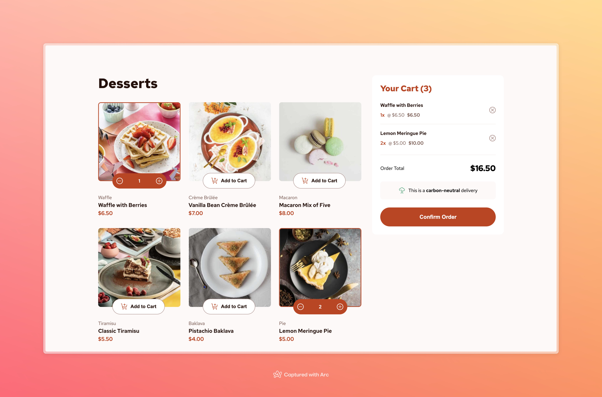

# Frontend Mentor - Product list with cart solution

This is a solution to the [Product list with cart challenge on Frontend Mentor](https://www.frontendmentor.io/challenges/product-list-with-cart-5MmqLVAp_d). Frontend Mentor challenges help you improve your coding skills by building realistic projects.

## Table of contents

- [Overview](#overview)
  - [The challenge](#the-challenge)
  - [Screenshot](#screenshot)
  - [Links](#links)
- [My process](#my-process)
  - [Built with](#built-with)
  - [What I learned](#what-i-learned)
  - [Useful resources](#useful-resources)
- [Author](#author)

## Overview

### The challenge

Users should be able to:

- Add items to the cart and remove them
- Increase/decrease the number of items in the cart
- See an order confirmation modal when they click "Confirm Order"
- Reset their selections when they click "Start New Order"
- View the optimal layout for the interface depending on their device's screen size
- See hover and focus states for all interactive elements on the page

### Screenshot

### Links

- Solution URL: [https://www.frontendmentor.io/solutions/product-list-with-usereducer-and-context-nicA5beDv\_](https://www.frontendmentor.io/solutions/product-list-with-usereducer-and-context-nicA5beDv_)
- Live Site URL: [https://product-list-with-cart-by-samuel-adu.vercel.app](https://product-list-with-cart-by-samuel-adu.vercel.app)

## My process

### Built with

- Semantic HTML5 markup
- CSS custom properties
- Flexbox
- CSS Grid
- Mobile-first workflow
- [React](https://reactjs.org/) - JS library
- useReducers

### What I learned

I did this project to solidify my knowledge of state management, so when I had to manage the state of the cart I didn't want to reach for Redux because it would be an overkill for a small state like just the cart, so I used React's useReducers combine with context and I found this to be very simple and optimal.

### Useful resources

- [How to implement useState with useReducer](https://kentcdodds.com/blog/how-to-implement-usestate-with-usereducer)
- [Application State Management with React](https://kentcdodds.com/blog/application-state-management-with-react)

## Author

- Website - [samueladu.dev](https://www.samueladu.dev)
- Frontend Mentor - [@samuel-adu](https://www.frontendmentor.io/profile/samuel-adu)
- LinkedIn - [in/thesamueladu](https://www.linkedin.com/in/thesamueladu)
